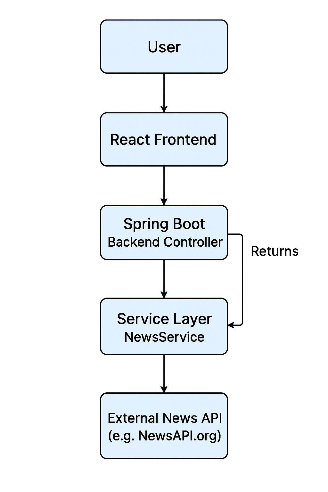

# 📰 News Aggregator

## 📘 Overview
The **News Aggregator** is a full-stack web application that collects and displays the latest news from multiple sources through a unified interface.  
Users can search for specific topics, view trending news, and read summaries—all within a clean and responsive interface.

---

## 🚀 Tech Stack

### **Frontend**
- React.js
- HTML5
- CSS3
- JavaScript (ES6)

### **Backend**
- Java (Spring Boot)
- RESTful APIs
- JSON for data exchange

---

## 🎯 Key Features
- Real-time news fetching from external APIs (like NewsAPI.org)
- Search functionality by keyword or category
- Responsive UI built with React.js
- Clear separation between frontend and backend layers
- Extensible architecture for adding new data sources

---

## ⚙️ Design & Implementation Approach

### **Frontend (React.js)**
1. **Component-Based Architecture:**
    - Built with reusable components such as `SearchBar`, `NewsCard`, and `NewsList`.
    - This makes the code more modular and maintainable.

2. **State Management:**
    - Uses React hooks (`useState`, `useEffect`) for managing and updating UI state.
    - When a user searches for a keyword, the frontend triggers an API request and updates the displayed articles dynamically.

3. **API Integration:**
    - Communicates with the backend through REST API calls using `fetch()` or `axios`.
    - Example API call:
      ```
      GET http://localhost:8080/api/news?keyword=technology&page=1
      ```

4. **UI/UX Design:**
    - Simple, clean, and responsive layout.
    - Uses CSS Flexbox and Grid for layout design.

---

### **Backend (Spring Boot)**
1. **Controller Layer:**
    - Defines endpoints such as `/api/news` that receive requests from the frontend.

2. **Service Layer:**
    - Handles business logic, including connecting to external APIs and filtering the fetched data.

3. **Integration Layer:**
    - Uses `RestTemplate` or `WebClient` to communicate with third-party news APIs.

4. **Model Layer:**
    - Contains POJOs (Plain Old Java Objects) to map external API responses into Java objects.

5. **Data Flow:**
    - The backend fetches JSON data from external sources, processes it, and returns a simplified response to the frontend.

---

## 🧠 Design Patterns Used

| **Pattern** | **Used In** | **Purpose / Explanation** |
|--------------|-------------|----------------------------|
| **MVC (Model-View-Controller)** | Spring Boot architecture | Separates logic into controller, service, and model layers. |
| **Singleton Pattern** | API Client Configuration | Ensures only one instance of `RestTemplate` or `WebClient` is created. |
| **Factory Pattern** | Service Layer | Used to create API clients dynamically (if multiple APIs are integrated). |
| **Observer Pattern** | React Components | The UI automatically updates (re-renders) when state changes. |

---


## 📊 System Flowchart

Below is the architecture and data flow of the application:
we can see the flowchart in below path

> **Note:** The flowchart illustrates the interaction between the User, React Frontend, Spring Boot Backend, Service Layer, and External News API.




